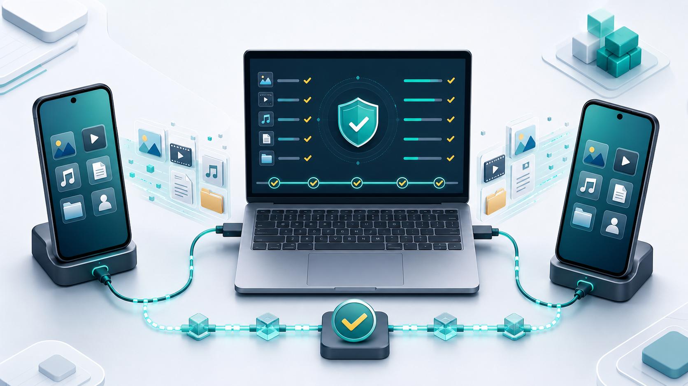
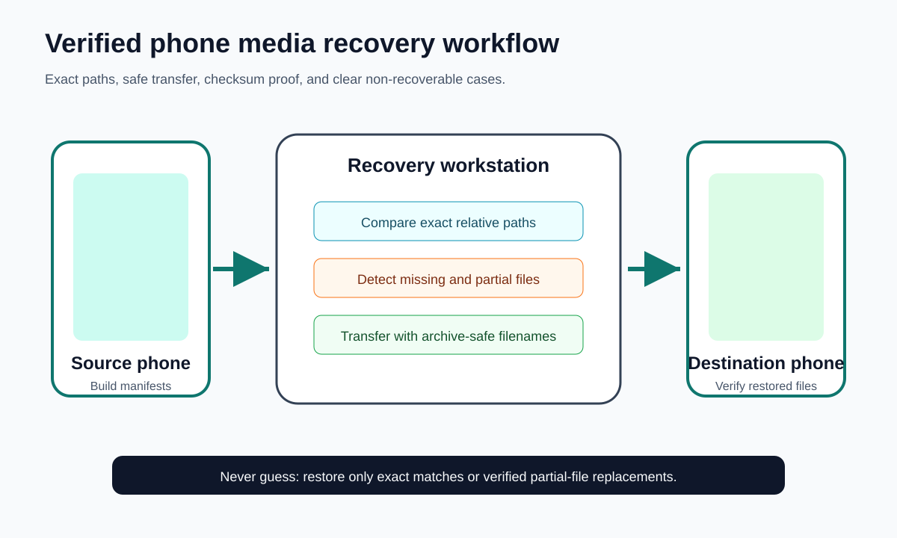
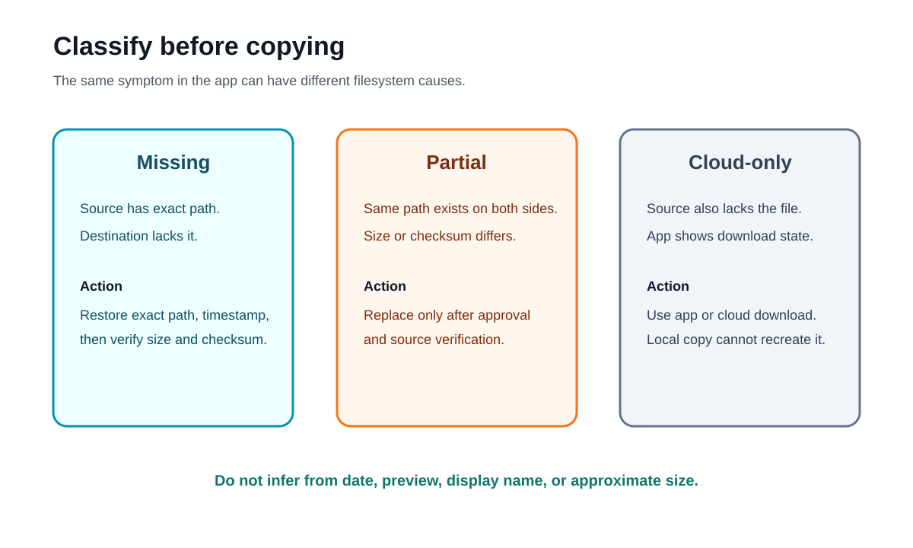
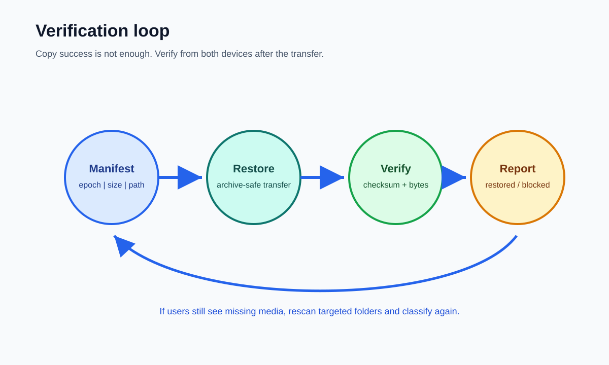

<div align="center">



# 📱 Phone Media Recovery · שחזור מדיה מהטלפון

### Safely recover missing media between two Android phones — exact path matching, verified transfers, checksum validation.
### שחזור בטוח של מדיה חסרה בין שני טלפוני אנדרואיד — התאמת נתיב מדויקת, העברה מאומתת, אימות טביעת-אצבע.

<br>


<br>

> **📌 Scope:** Android-to-Android recovery (via ADB). iPhone / cross-platform is **not** supported.
> **📌 היקף:** שחזור אנדרואיד-לאנדרואיד (דרך ADB). iPhone / חוצה-פלטפורמות **אינו** נתמך.

<br>

### 🌐 &nbsp; **[🇮🇱 עברית](#hebrew)** &nbsp;·&nbsp; **[🇬🇧 English](#english)**

</div>

---

<a id="hebrew"></a>

# 🇮🇱 עברית

## 📖 מה זה?

כשמעבירים **טלפון אנדרואיד** — **Samsung Smart Switch, העברה בכבל, שחזור גיבוי (Google/מקומי), או העתקה ידנית** — מסד הנתונים של הצ'אטים והגלריה בדרך כלל עובר, אבל **קובצי המדיה עצמם לרוב לא מועתקים במלואם**.

התוצאה מבלבלת ומתסכלת: וואטסאפ מציג מסמך, תמונה מופיעה בצ'אט, סרטון יושב בשיחה — אבל בלחיצה מקבלים **"הקובץ לא נמצא"** או **חץ הורדה** תקוע.

**Phone Media Recovery** היא מתודולוגיה ממושמעת + כלים, ש:

1. **מאתרים בדיוק אילו קבצים חסרים** — בהשוואת שני הטלפונים קובץ-מול-קובץ.
2. **משחזרים רק אותם** — לנתיב המקורי המדויק, בייט-בבייט.
3. **מוכיחים שזה עבד** — אימות גודל + טביעת-אצבע (checksum) ושימור התאריך המקורי.

הכלל המרכזי: **בלי ניחושים.** התאמה לפי **נתיב ושם מדויקים בלבד** — לעולם לא לפי "נראה דומה", שם תצוגה, תמונה ממוזערת או גודל מקורב. זה מה שהופך את השחזור לאמין.

> הסקיל נולד ממקרה אמיתי: ~12,000 קובצי מדיה של וואטסאפ ש-Smart Switch השמיט בשקט בשדרוג טלפון — שוחזרו ואומתו ללא אובדן נתונים.

## 👥 למי זה מיועד

| אתה… | זה עוזר לך… |
|------|-------------|
| **החלפת טלפון אנדרואיד** | להחזיר מסמכים/תמונות/סרטונים של וואטסאפ שמראים "הקובץ לא נמצא". |
| **טכנאי / מעבדה** | להריץ שחזור שמרני ומאומת בין שני טלפוני אנדרואיד. |
| **משתמש מתקדם / הקשר פורנזי** | להפיק תיעוד שחזור מאומת לפי checksum ותאריך מדויק. |

**קטגוריות מדיה:** מסמכים · תמונות · סרטונים · אודיו · הודעות קוליות · הודעות וידאו · סטיקרים · GIF · גלריה/DCIM · הורדות — וכל מה ששמור תחת תיקיית המדיה של אפליקציה.

## 🧭 תקן השחזור — 7 עקרונות

1. **שמירה על נתוני המשתמש קודם.** לעולם לא למחוק/לדרוס קובץ ביעד אלא אם זה אותו נתיב מדויק *וגם* המקור הוא עותק חזק יותר ומאומת — או באישור מפורש.
2. **להבדיל בין שלושת המצבים:** `חסר` (יש במקור, אין ביעד) · `חלקי/פגום` (קיים בשניהם אבל גדלים שונים) · `לא הורד/ענן בלבד` (גם המקור חסר אותו → לא ניתן לשחזר מקבצים).
3. **להשוות נתיבי אחסון, לא שמות תצוגה.** אפליקציות מציגות שם ידידותי אבל שומרות שם מקודד (`DOC-20260601-WA0038`, `IMG-…`, לפעמים *בלי סיומת*).
4. **לאמת כל קובץ משוחזר** בגודל **וגם** ב-checksum (MD5 למהירות, SHA-256 לביקורת).
5. **לשמר תאריכים** — רוב כלי ההעתקה מאפסים את זמן השינוי; כאן משחזרים את המקורי.
6. **להימנע ממלכודות נירמול נתיב של Windows** — שמות שמסתיימים בנקודה או עם Unicode חריג לא "שורדים" תיקייה של Windows, ולכן ההעברה דרך **ארכיון/זרם** (`tar`), לא קבצים בודדים.
7. **לתעד בבירור את המקרים שאינם ניתנים לשחזור** במקום לזייף תוצאה.

## 🔁 איך זה עובד

<div align="center">

</div>

| # | שלב | מה קורה |
|---|-----|---------|
| **1** | **מיפוי מקורות והיקף** | אינוונטר של כל מקור: טלפון ישן, חדש, ייצוא במחשב, תיקיות staging, גיבויים, כרטיסי SD. |
| **2** | **בחירת גישה למכשיר** | הדרך הבטוחה ביותר (ADB / MTP / כלי יצרן / כרטיס SD). ראה [`platform-playbook.md`](references/platform-playbook.md). |
| **3** | **בניית מניפסטים** | רשימת כל קובץ בכל צד כ-`epoch\|size\|path`. באנדרואיד: `find … -exec stat -c '%Y\|%s\|%n' {} +`. |
| **4** | **השוואת מניפסטים** | השוואה דטרמיניסטית → `missing.txt`, `different.txt`, `touch.txt`, `summary.json`. |
| **5** | **שחזור (בטוח-שמות)** | העברה דרך `tar` על המכשיר כדי שהשמות המדויקים ישרדו — לא קבצים בודדים דרך Windows. |
| **6** | **אימות** | סריקה מחדש ועצמאית של שני הצדדים; השוואת גודל + checksum לכל נתיב; שחזור תאריכים; בדיקה באפליקציה. |
| **7** | **חקירת "עדיין חסר"** | הרחבת היקף (סטיקרים, סטטוסים, קבצים בלי סיומת), ובדיקת קבצים *חלקיים*, לא רק חסרים. |

## 🗂️ סיווג מקרי שחזור

<div align="center">

</div>

| מקרה | מצב | פעולה |
|------|-----|-------|
| **A — חסר** | יש במקור, אין ביעד. | שחזור הנתיב המדויק, שימור תאריך, אימות. |
| **B — חלקי/פגום** | אותו נתיב בשניהם, אך גודל/checksum שונים. | לאשר כוונה → להחליף בהעברה בטוחה → לאמת. |
| **C — כפתור הורדה** | האפליקציה מצפה להורדה מהשרת; אין קובץ מקומי בשום מקום. | להשתמש בהורדה של האפליקציה — **לא** ניתן לשחזר מקבצים. |
| **D — אי-התאמת שם** | האפליקציה מציגה שם ידידותי; בדיסק שם מקודד. | התאמה לפי מטא-דאטה ונתיב, לא לפי השם הנראה. |
| **E — קטגוריות מחוץ להיקף** | סטיקרים, הודעות קוליות, סטטוסים, קבצים בלי סיומת. | לסרוק כל קטגוריה בנפרד ולהשוות. |
| **F — מטמון/DB/גיבוי** | זמני, תמונות ממוזערות, מסדי נתונים, אשפה. | **לא להעתיק כברירת מחדל** — חקירה בלבד. |

## ✅ אימות וביקורת

האימות **בלתי תלוי בפקודת ההעתקה** — העברה "הושלמה" רק כשסריקה טרייה ונפרדת מוכיחה זאת.

<div align="center">

</div>

- **בדיקת מינימום לכל קובץ:** נתיב יחסי · גודל בבייטים · checksum · תאריך.
- **בחירת checksum:** `MD5` להשוואה מהירה באותו סשן · `SHA-256` לביקורת/משפט/תיעוד ארוך-טווח.
- **שימור תאריך:** לרשום epoch במניפסט, ואז להחיל מחדש אחרי השחזור:
  ```sh
  touch -d "@1712345678" "$DEST/relative/path/file.ext"
  ```
- **דגלים אדומים שעוצרים את התהליך:** קובץ משוחזר `0` בייט בעוד המקור לא · שם השתנה (נקודה/רווח בסוף, Unicode חריג) · ספירת `find` כוללת לא תואמת לסריקה לפי תיקייה · האפליקציה עדיין מראה חסר אחרי שחזור מאומת + אתחול.

## 🚫 מה הכלי **לא** יעתיק

כדי להגן על הטלפון החדש, אלה **לעולם** לא מועתקים באופן עיוור: מסדי נתונים של אפליקציה · גיבויים מוצפנים בלי תאימות מפתח/גרסה · תיקיות מטמון (`.tmp`, תמונות ממוזערות, תורי עבודה) · תיקיות אשפה · placeholders של ענן.

---

<a id="english"></a>

# 🇬🇧 English

## 📖 What is this?

When you move an **Android phone** — **Samsung Smart Switch, a cable transfer, a Google/local backup restore, or a manual copy** — the chat and gallery *database* usually moves, but the actual **media files often do not fully copy across**.

The result is painful and confusing: WhatsApp shows a document, a photo appears in a chat, a video sits in the conversation — but when you tap it you get **“File not found”** or a stuck **download arrow**.

**Phone Media Recovery** is a disciplined methodology *plus* tooling that:

1. **Finds exactly which files are missing** — by comparing the two phones file-by-file.
2. **Restores only those files** — to their exact original path, byte-for-byte.
3. **Proves it worked** — with size + checksum verification and original-timestamp preservation.

It is built around one strict promise: **no guessing.** Files are matched by *exact path and filename* — never by “looks similar”, display name, thumbnail, or approximate size.

> This skill was forged from a real-world recovery: ~12,000 WhatsApp media files that Smart Switch silently dropped during a phone upgrade, restored and verified with zero data loss.

## 👥 Who it's for

| You are… | This helps you… |
|----------|-----------------|
| **Someone who switched Android phones** | Get back WhatsApp documents/photos/videos that show “file not found”. |
| **A technician / repair shop** | Run an auditable, conservative recovery between two Android phones. |
| **A power user / forensic context** | Produce checksum-verified, timestamp-accurate restoration records. |

**Media categories:** documents · images · videos · audio · voice notes · video notes · stickers · GIFs · DCIM/gallery · downloads — and anything under an app's media root.

## 🧭 The recovery standard — 7 rules

1. **Preserve user data first.** Never delete/overwrite a destination file unless it is the exact same path *and* the source is a stronger, verified copy — or the user explicitly approves.
2. **Distinguish the three states:** `missing` vs. `partial/corrupt` (sizes differ) vs. `not-downloaded/cloud-only` (source lacks it too → not recoverable from files).
3. **Compare storage paths, not display names.** Apps show friendly names but store encoded ones (`DOC-20260601-WA0038`, sometimes *no extension*).
4. **Verify every restored file** with byte size **and** checksum (MD5 for speed, SHA-256 for audit).
5. **Preserve timestamps** — most copy tools reset modified-time; this restores the original.
6. **Avoid Windows path-normalization hazards** — names ending in a dot or with unusual Unicode can't round-trip through a Windows folder, so transfers use **archives/streams** (`tar`).
7. **Document the non-recoverable cases** clearly instead of faking a result.

## 🔁 How it works

<div align="center">

</div>

| # | Stage | What happens |
|---|-------|--------------|
| **1** | **Establish sources & scope** | Inventory every source: old phone, new phone, computer exports, vendor staging, backups, SD cards. |
| **2** | **Choose device access** | Pick the safest path (ADB / MTP / vendor tools / SD card). |
| **3** | **Build manifests** | List every file per side as `epoch\|size\|path`. |
| **4** | **Compare manifests** | Deterministic diff → `missing.txt`, `different.txt`, `touch.txt`, `summary.json`. |
| **5** | **Restore (filename-safe)** | Transfer via on-device `tar` so exact names survive. |
| **6** | **Verify** | Re-scan both sides independently; compare size + checksum; restore timestamps; spot-check in the app. |
| **7** | **Investigate “still missing”** | Widen scope (stickers, statuses, no-extension files); re-check *partial* files too. |

## 🗂️ Recovery case classification

<div align="center">

</div>

| Case | Situation | Action |
|------|-----------|--------|
| **A — Missing** | Source has the exact path; destination doesn't. | Restore exact path, preserve timestamp, verify. |
| **B — Partial / corrupt** | Same path on both, size/checksum differ. | Confirm intent → replace via filename-safe transfer → verify. |
| **C — Download button** | App expects a server download; no local file anywhere. | Use the app's own download — **not** recoverable from files. |
| **D — Name mismatch** | App shows friendly name; disk uses encoded name. | Match by metadata + app-relative path, not the visible name. |
| **E — Out-of-scope categories** | Stickers, voice notes, statuses, no-extension files. | Rescan each category independently. |
| **F — Cache / DB / backup** | Temp, thumbnails, databases, trash. | **Do not copy by default** — investigation only. |

## ✅ Verification & audit

Verification is **independent of the copy command** — a transfer is only “done” when a fresh, separate scan proves it.

<div align="center">

</div>

- **Minimum check per file:** relative path · byte size · checksum · timestamp.
- **Checksum choice:** `MD5` for fast same-session comparison · `SHA-256` for audit/legal records.
- **Timestamp preservation:**
  ```sh
  touch -d "@1712345678" "$DEST/relative/path/file.ext"
  ```
- **Red flags that stop the process:** a restored file is `0` bytes while the source isn't · a filename changed · full-tree totals disagree with per-folder scans · the app still shows the file missing after a verified restore + reboot.

## 🚫 What it will *not* copy

To protect the destination phone, these are **never** copied blindly: app databases · encrypted backups without key/version compatibility · cache folders (`.tmp`, thumbnails, work queues) · trash folders · cloud placeholders.

---

## ⚙️ Installation / התקנה

### Prerequisites / דרישות מקדימות

| Tool / כלי | For / עבור |
|------|-----------|
| **[ADB](https://developer.android.com/tools/adb)** (Android Platform Tools) | Android device access & transfer / גישה והעברה |
| **Python 3.8+** | `scripts/compare_manifests.py` |
| **PowerShell 7+** | `scripts/android_tar_restore.ps1` |
| **ffmpeg / ffprobe** *(optional / רשות)* | Inspecting media / בדיקת מדיה |

> Both phones need **USB debugging (ADB)** enabled. / שני הטלפונים צריכים **ניפוי באגים USB (ADB)** מופעל.

### Option A — Claude Code skill

```bash
# user-level / רמת משתמש
git clone https://github.com/yackov43/phone-media-recovery-skill.git \
  ~/.claude/skills/phone-media-recovery

# project-level / רמת פרויקט
git clone https://github.com/yackov43/phone-media-recovery-skill.git \
  .claude/skills/phone-media-recovery
```

### Option B — Codex / OpenAI agent skill

Ships an agent manifest at [`agents/openai.yaml`](agents/openai.yaml). Place the folder in your agent's skills directory and register it. Default invocation:

```text
Use $phone-media-recovery to diagnose and safely restore missing phone media between devices.
```

### Option C — Standalone scripts / סקריפטים עצמאיים

```bash
git clone https://github.com/yackov43/phone-media-recovery-skill.git
cd phone-media-recovery-skill
python scripts/compare_manifests.py --help
```

---

## 🚀 Quick start

```bash
# 1) Confirm both phones / לוודא ששני הטלפונים מחוברים
adb devices -l

# 2) Build a manifest per category on EACH phone / מניפסט לכל קטגוריה בכל טלפון
adb -s <SERIAL> shell "find '/storage/emulated/0/Android/media/com.whatsapp/WhatsApp/Media/WhatsApp Documents' \
  -type f -exec stat -c '%Y|%s|%n' {} +" > old_documents.txt

# 3) Compare → missing.txt / different.txt / touch.txt / summary.json
python scripts/compare_manifests.py \
  --old old_documents.txt --new new_documents.txt \
  --old-root "/storage/emulated/0/Android/media/com.whatsapp/WhatsApp/Media/WhatsApp Documents/" \
  --new-root "/storage/emulated/0/Android/media/com.whatsapp/WhatsApp/Media/WhatsApp Documents/" \
  --out-dir recovery_plan
```

```powershell
# 4) Restore the missing files, filename-safe, with verification
powershell -ExecutionPolicy Bypass -File scripts/android_tar_restore.ps1 `
  -Adb "C:\path\to\adb.exe" `
  -OldSerial "<old-serial>" -NewSerial "<new-serial>" `
  -Base "/storage/emulated/0/Android/media/com.whatsapp/WhatsApp/Media/WhatsApp Documents" `
  -List recovery_plan\missing.txt -TouchList recovery_plan\touch.txt -Key "documents"
```

> The restore is **additive** — it only adds files the destination is missing. It never deletes or overwrites your data.
> השחזור הוא **תוספתי** — מוסיף רק קבצים שחסרים ביעד. לעולם לא מוחק ולא דורס.

---

## 📜 Scripts

| Script | Purpose / תפקיד |
|--------|---------|
| [`scripts/compare_manifests.py`](scripts/compare_manifests.py) | Deterministic manifest diff → `missing.txt`, `different.txt`, `touch.txt`, `summary.json`. |
| [`scripts/android_tar_restore.ps1`](scripts/android_tar_restore.ps1) | Tar-based verified restore: archive on source → one pull/push → extract on destination → restore timestamps → verify (fails if size/checksum differ). |

## 📁 Repository structure

```text
phone-media-recovery-skill/
├── SKILL.md                       # Skill definition (rules + workflow)
├── README.md                      # You are here
├── LICENSE                        # MIT
├── agents/openai.yaml             # Codex / OpenAI agent manifest
├── references/
│   ├── platform-playbook.md       # Android access paths
│   ├── recovery-cases.md          # Case A–F classification
│   └── verification.md            # Checksum, timestamp & audit practices
├── scripts/
│   ├── compare_manifests.py       # Manifest comparison
│   └── android_tar_restore.ps1    # Verified tar restore
└── assets/
    ├── recovery-cover.png         # Cover illustration
    ├── recovery-workflow.svg      # Workflow diagram
    ├── case-classification.svg    # Case diagram
    ├── verification-loop.svg      # Verification diagram
    └── icon-small.svg             # Skill icon
```

## 📚 References

- **[`SKILL.md`](SKILL.md)** — the full skill definition.
- **[`references/platform-playbook.md`](references/platform-playbook.md)** — Android access paths.
- **[`references/recovery-cases.md`](references/recovery-cases.md)** — case classification.
- **[`references/verification.md`](references/verification.md)** — checksum, timestamp & audit practices.

---

## 📄 License

Released under the [MIT License](LICENSE). © 2026 yackov43.

## ⚠️ Disclaimer / הבהרה

**EN:** Android-to-Android recovery only. Works on user-accessible storage, official backups, and verified copies — assumes **no root** unless you choose otherwise. Conservative by design and additive by default, but you are responsible for backing up important data first. Files never downloaded to any available source (cloud-only) cannot be reconstructed from local files.

**עברית:** שחזור אנדרואיד-לאנדרואיד בלבד. עובד על אחסון נגיש למשתמש, גיבויים רשמיים ועותקים מאומתים — מניח **ללא root** אלא אם תבחר אחרת. שמרני ותוספתי בברירת מחדל, אך באחריותך לגבות נתונים חשובים תחילה. קבצים שמעולם לא הורדו לאף מקור (ענן בלבד) לא ניתנים לשחזור מקבצים מקומיים.

<div align="center">
<br>
<sub>Built for trustworthy, verifiable Android media recovery · no guessing, only exact matches.<br>נבנה לשחזור מדיה אמין ומאומת באנדרואיד · בלי ניחושים, רק התאמות מדויקות.</sub>
</div>
